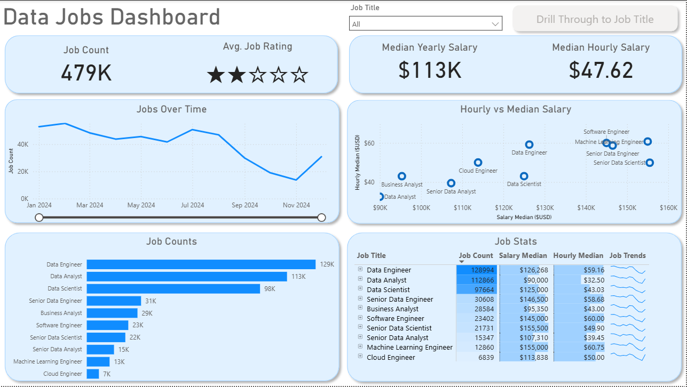
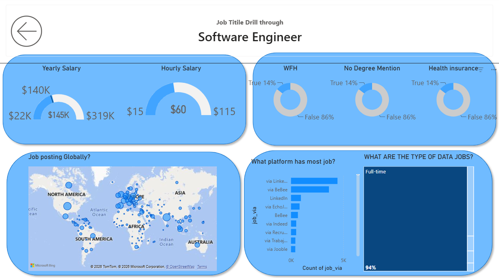

# 📊 Data Jobs Dashboard w/ Power BI

> 📊 [View Interactive Dashboard on Power BI Service](https://lukeb.co/powerbi-project1)

---

## 📌 Introduction

This dashboard was created for **Job Seekers, Job Transitioners, and Job Swappers** to solve a common problem: information about the data job market is scattered and hard to grasp.

Using a real-world dataset of **2024 data science job postings**, including job titles, salaries, locations, and other job-related information, this project provides a single, easy-to-use interface to explore **job market trends, salaries, job counts, and employment opportunities**.

---

## 📁 Dashboard File

You can find the Power BI dashboard file here:

[**Download Data_Jobs_Dashboard.pbix**](Data_Jobs_Dashboard.pbix)

---

## 🛠️ Skills Showcased

This project demonstrates several important Power BI and data analytics skills:

- ⚙️ **Data Transformation (ETL) with Power Query**
  - Cleaned and shaped raw data
  - Handled missing values
  - Changed data types
  - Created calculated columns

- 🧮 **Measures & KPIs**
  - Job Count
  - Median Yearly Salary
  - Median Hourly Salary
  - Average Job Rating

- 📊 **Data Visualization**
  - Bar Charts
  - Column Charts
  - Line Charts
  - Area Charts
  - Scatter Charts
  - Tables
  - Cards

- 🗺️ **Geospatial Analysis**
  - Used map visualizations to analyze the global distribution of data jobs.

- 🎨 **Dashboard Design**
  - Created a clean and interactive dashboard layout.
  - Used consistent formatting and visual hierarchy.

- 🖱️ **Interactive Reporting**
  - Slicers
  - Buttons
  - Bookmarks
  - Drill-through pages
  - Interactive filtering

---

## 📊 Dashboard Overview

This report contains **two pages**:

1. **High-Level Market View**
2. **Job Title Drill Through**

---

## 1️⃣ Page 1: High-Level Market View

The first page provides a high-level overview of the data job market.

It includes:

- Total Job Count
- Average Job Rating
- Median Yearly Salary
- Median Hourly Salary
- Jobs Over Time
- Hourly vs Median Salary
- Job Counts by Job Title
- Job Statistics
- Job Title Slicer

### Dashboard Preview

This page helps users quickly understand **which data jobs are most common, how salaries compare, and how job postings change over time**.

---

## 2️⃣ Page 2: Job Title Drill Through

The second page provides a detailed analysis for a selected job title.

It includes:

- Yearly Salary
- Hourly Salary
- Work From Home (WFH) statistics
- Degree requirements
- Health insurance availability
- Global job posting locations
- Job posting platforms
- Job type distribution

### Dashboard Preview

The **Drill Through** feature allows users to select a specific job title from the first page and explore detailed information about that role.

---

## 🔍 Key Features

### 🎯 Job Title Filtering

Users can select a specific job title to dynamically filter the dashboard.

### 💰 Salary Analysis

The dashboard provides insights into:

- Median yearly salary
- Median hourly salary
- Salary comparison between different data roles

### 📈 Job Market Trends

The **Jobs Over Time** chart helps identify changes in job postings throughout 2024.

### 🌎 Global Job Distribution

The map visual provides a geographical overview of where data-related jobs are being posted around the world.

### 🔄 Drill Through

Users can move from the high-level dashboard to a detailed job-title-specific analysis.

---

## 📷 Dashboard Screenshots

### Page 1 — Data Jobs Dashboard

### Page 2 — Job Title Drill Through

---

## 🧰 Tools & Technologies

- **Microsoft Power BI**
- **Power Query**
- **DAX**
- **Data Cleaning**
- **Data Transformation**
- **Data Visualization**
- **Interactive Dashboard Design**

---

## 📌 Conclusion

This dashboard demonstrates how **Power BI can transform raw job posting data into an interactive career-analysis tool**.

It allows users to explore job counts, salaries, job trends, locations, and job requirements through interactive filters and drill-through functionality.

The project demonstrates practical skills in **data cleaning, data analysis, visualization, dashboard design, and Power BI reporting**.

---

## 👨‍💻 Project

**Project:** Data Jobs Dashboard  
**Tool:** Microsoft Power BI  
**Dataset:** 2024 Data Science Job Postings

📊 [View Interactive Dashboard](https://lukeb.co/powerbi-project1)
